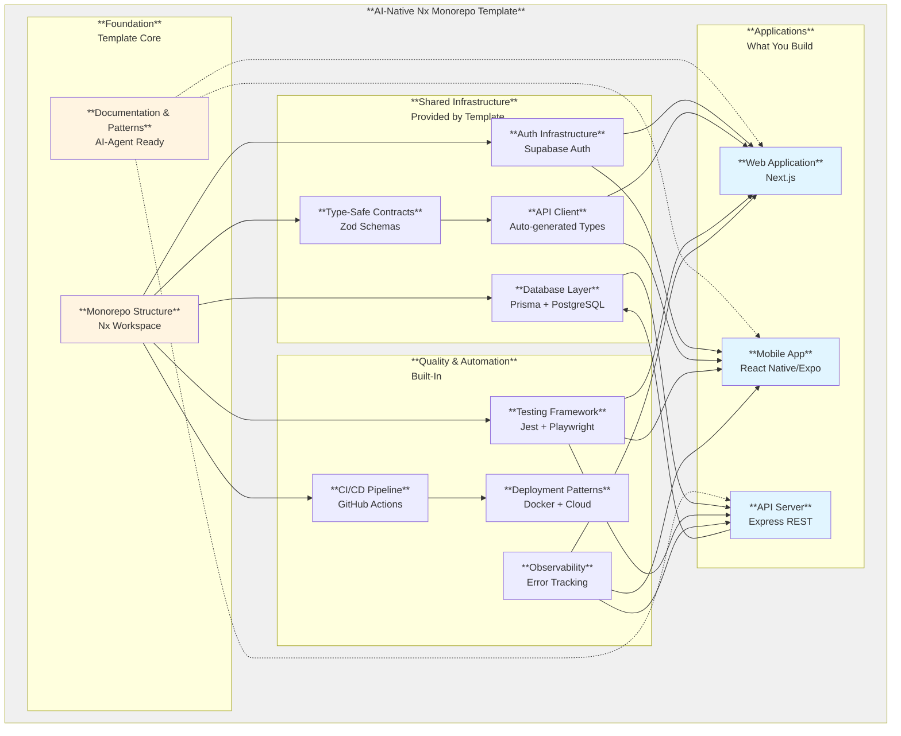

# AI-Native Nx Monorepo Template - Product Requirements Document

**Author:** Jørn
**Date:** 2025-11-18
**Version:** 1.0

---

## Executive Summary

The AI-Native Nx Monorepo Template is a production-ready foundation for building type-safe, full-stack applications with shared business logic across web, server, and mobile platforms. This template is specifically designed for AI-first development workflows, where AI coding agents serve as the primary development workforce, with human architects and product managers providing strategic direction.

Unlike traditional monorepo templates that assume human developers will learn through experimentation and documentation, this template is architected to work seamlessly with AI agent frameworks. The template provides explicit pattern documentation, comprehensive architectural decision records, and structured configuration that AI agents can parse and apply consistently across the monorepo. The "walking skeleton" approach validates that all infrastructure layers work together before feature development begins, reducing the discovery of integration issues during critical development phases.

The template front-loads foundational architectural, tooling, and governance decisions, delivering not just basic scaffolding but a complete production infrastructure. This includes comprehensive QA automation (Jest for unit tests, Playwright for E2E), CI/CD pipelines with GitHub Actions, observability through Sentry integration, end-to-end type safety (database → API → UI), and deployment patterns for lightweight hosting platforms. The vision is to enable small teams (1-5 people) with high technical literacy but limited coding resources to build production-ready applications by orchestrating AI coding agents using gold-standard infrastructure patterns.

The MVP's technical quality and completeness is validated through the template infrastructure itself and the working walking skeleton that exercises all layers end-to-end. Following MVP completion, a Task App proof-of-concept serves a different purpose: demonstrating that a single human orchestrator, supported by AI coding agents, can deliver production-ready features through an efficient assembly-line process while maintaining comprehensive quality gates and architectural consistency.

### What Makes This Special

**AI-Native Architecture:**
- Explicit architectural decisions and patterns documented in structured formats that AI agents can parse and apply consistently
- Clear separation of concerns: template provides infrastructure patterns, applications implement business logic
- Type-safe contracts and boundaries that guide AI agents toward correct implementations
- Consistent monorepo structure with predictable conventions across all projects

**Production-Ready from Day One:**
- Complete CI/CD infrastructure with automated quality gates, linting, testing, and deployment pipelines
- End-to-end type safety from database schema through API contracts to UI components
- Comprehensive testing strategy with unit tests, integration tests, and E2E browser tests
- Walking skeleton validates all layers before feature development and remains as permanent validation harness
- Integrated observability and deployment patterns for lightweight hosting platforms

**Building-Block Philosophy:**
- Reusable infrastructure patterns and shared libraries, not opinionated business logic
- Scales seamlessly as the monorepo grows without requiring architectural refactoring
- Clear separation: template provides building blocks, applications implement features
- Flexible deployment options with validated patterns for one or two lightweight hosting platforms
- No vendor lock-in: provider-agnostic architecture supports multiple deployment targets

---

## Scope of this PRD (WHAT vs HOW)

**WHAT:** Establishes the canonical architectural boundaries and mandatory technology surfaces that constitute the product. This template is fundamentally an architectural artifact that defines infrastructure patterns and technology constraints, not a feature-complete application.

**WHY:** Documents the strategic rationale for these boundaries, including agent-first development support, end-to-end type safety, deployment portability, and repeatable quality gates.

**HOW:** Implementation design and technical trade-offs are elaborated in the architecture phase. Epic and story decomposition occurs during the planning phase following architectural specification.

---

## Project Classification

**Technical Type:** Infrastructure Template & Development Foundation  
**Domain:** Software Development Tooling / Monorepo Architecture  
**Complexity:** High – multi-application, multi-package, cross-platform infrastructure requiring concurrent validation across all layers  
**Primary Users:** Human architects and product managers orchestrating AI coding agents

This is a meta-product: the deliverable is the reusable template itself that provides infrastructure patterns optimized for AI-first development workflows. The work spans infrastructure (Nx + pnpm), backend (Express + Prisma + Supabase), frontend (Next.js), mobile (Expo-ready), QA automation, observability, and DevOps workflows. Complexity is high because every layer must be validated concurrently, yet the end-user experience must stay lightweight enough for rapid AI-driven iteration.

### Domain Context

Traditional development templates assume human developers who learn through experimentation and adapt patterns intuitively. This template is designed to work seamlessly with AI agent frameworks through explicit architectural decisions, structured pattern documentation, and clear governance boundaries. The template is framework-agnostic but framework-ready—providing the structured foundation that allows AI agent frameworks to be applied plug-and-play without requiring template modifications. This architectural approach enables human orchestrators to direct AI coding agents effectively without firefighting setup debt or pattern inconsistencies.

---

## Architectural Building Blocks (WHAT)

This section defines the foundational technology architecture for the template. These represent initial technology choices selected for their maturity, AI-agent compatibility, and type-safety characteristics. The architecture is designed to be modular—specific technologies can be replaced provided the underlying capabilities and architectural principles are maintained.

**What This Diagram Shows:**
- **Foundation Layer (Yellow):** The template core that provides structure and AI-ready documentation
- **Shared Infrastructure (White):** Reusable components all applications use (database, type-safe contracts, authentication)
- **Quality & Automation (White):** Built-in testing, CI/CD, monitoring, and deployment patterns
- **Applications (Blue):** The actual products you build on top of the template (web, mobile, API)

The template eliminates 80% of setup work by providing battle-tested infrastructure that "just works" - letting teams focus on building features, not wiring up databases and deployment pipelines.

### Architectural Capabilities & Principles

**Monorepo Structure & Modularity**
- Build system supporting multi-application, multi-package workspaces with intelligent caching
- Buildable shared libraries with unidirectional dependency flow
- Strict boundaries: applications depend on packages; no app-to-app imports; no dependency cycles

**Type Safety Flow (Single Source of Truth)**
- Schema definitions generate API specifications, which generate type-safe client code
- Database schema generates strongly-typed data access layer
- Compile-time validation of API contracts across all consumers

**Security Architecture**
- API server establishes the security boundary for all data operations
- Client applications use authentication services for identity; all data access routed through API
- Environment configuration validated at startup; database row-level security with API bypass

**Quality Assurance Infrastructure**
- Unit testing framework with support for component and function-level tests
- Integration testing for cross-layer validation
- End-to-end browser testing for user journey validation
- Automated quality gates in CI/CD pipeline

**Deployment & Operations**
- Containerization support for consistent deployment across environments
- CI/CD automation with secrets management
- Observability platform integration for error tracking and performance monitoring
- Provider-agnostic deployment patterns supporting multiple hosting platforms

**Scalability Design**
- Template supports 6–8 applications and 8–10 packages without architectural refactoring
- Clean dependency graph maintained as workspace grows

**Separation of Concerns**
- **Template provides:** Shared libraries, authentication infrastructure, testing patterns, CI/CD patterns, API contract generation, database access layer, observability baseline
- **Applications implement:** Authentication UI/flows, domain models, business logic, deployment platform selections

### Technology Mappings
- **Monorepo & Build System:** Nx with pnpm package management
- **Web Applications:** Next.js with React
- **API Server:** Express with REST+OpenAPI contract generation (Zod → zod-to-openapi → openapi-typescript → openapi-fetch type-safe client)
- **Database Layer:** Prisma ORM with PostgreSQL via Supabase
- **Testing Infrastructure:** Jest for unit/integration testing; Playwright for E2E browser testing
- **Type System:** TypeScript in strict mode
- **Code Quality:** ESLint (flat config) and Prettier
- **CI/CD:** GitHub Actions with Nx Cloud caching; Docker for containerization
- **Observability:** Sentry for server, web, and mobile error tracking and performance monitoring
- **Deployment Patterns:** Docker-based staging environment; production validation on multiple lightweight hosting platforms

---

## Success Criteria

### MVP Success Criteria

The MVP is validated when 
- A new engineer or orchestrator can clone the repository, install dependencies, configure environment variables, and
    - The walking skeleton runs end-to-end (web → API → database) without additional tooling work
    - All shared packages build, lint, and test successfully across the monorepo
    - Mobile project scaffolding exists and can consume the same API client and types as web, proving cross-platform parity
    - The Nx dependency graph remains clean with no circular dependencies
    - CI/CD pipeline deploys automatically to staging environment with secrets management
    - Pre-commit hooks enforce quality gates and block regressions
- Observability instrumentation is wired for server, web, and mobile applications
- Baseline authentication infrastructure is in place and ready for application-level implementation
- Documentation is comprehensive and accessible for AI agent frameworks

**Validation Method:** A new developer can complete the full setup and observe the working walking skeleton in under 30 minutes.

### Post-MVP Task App PoC Success Criteria

The Task App proof-of-concept validates the template when:

- A functional task/todo application (web + mobile) demonstrates CRUD operations, authentication-protected flows, and data persistence built entirely on the template
- CI/CD promotes automatically to one or two lightweight production platforms, proving deployment portability
- Test coverage reaches ≥80% across application and shared packages
- Observability captures errors and performance events across all application surfaces
- Architecture patterns observed in implementation align with documented standards
- No major infrastructure gaps are discovered during PoC development
- TDD workflows complete without tooling friction

**Primary Success Indicator:** The ultimate measure of PoC success is a subjective assessment by the human orchestrator that AI coding agents achieve approximately 70% first-pass code quality with minimal human rework. This qualitative evaluation considers code correctness, pattern adherence, and architectural consistency. Since this assessment is inherently subjective and context-dependent, it serves as a guiding principle rather than a measurable gate—success is determined by the team's confidence that the template, documentation, and architectural patterns effectively support AI-first development workflows.

---

## Product Scope

### MVP - Minimum Viable Product

The MVP delivers a complete, production-ready infrastructure template that validates all architectural building blocks working together. This includes:

- **Monorepo workspace** with multi-application and multi-package structure, dependency management, and build orchestration
- **Core applications**: Next.js web application, Express API server, and mobile application scaffolding (React Native/Expo)
- **Shared infrastructure packages**: Database layer, type-safe schemas, API client with generated types, and authentication client factories
- **Walking skeleton feature** that exercises all layers end-to-end (web → API → server → database) and remains as permanent validation harness
- **Comprehensive QA infrastructure**: Unit testing framework, integration testing patterns, E2E browser testing, and automated quality gates
- **CI/CD automation**: Build pipelines, automated testing, deployment to staging environment, and secrets management
- **Observability baseline**: Error tracking and performance monitoring instrumentation across all application surfaces
- **Authentication infrastructure wiring**: Client factories, middleware patterns, and integration points ready for application-level implementation
- **Documentation and patterns**: Architectural decision records, deployment guides, and structured documentation accessible to AI agent frameworks

The MVP proves that the template infrastructure is technically sound, complete, and ready to support feature development.

### Growth Features (Post-MVP)

**Phase 2: Task App Proof-of-Concept**

Following MVP completion, a Task App proof-of-concept validates the end-to-end development workflow:

- **Task App implementation**: A basic task application (web + mobile) designed to validate all key functions in the template, built entirely using the template's infrastructure
- **Full authentication experience**: User signup, login, and session management on both web and mobile platforms
- **Production deployment validation**: CI/CD pipelines extended to deploy automatically to one or two lightweight production platforms with environment-specific secrets
- **Comprehensive test coverage**: Raise test coverage to ≥80% across application and shared packages
- **Production-ready observability**: Enhanced monitoring dashboards and alerting for production environments

**Phase 3: Template Extensions (Future)**

Optional extensions demonstrating additional building blocks and patterns:

- **Advanced Infrastructure**: Real-time collaboration features, file upload and storage patterns, background job processing, webhook integrations
- **Multi-Tenancy**: Organization/workspace management, subscription and billing integration, admin dashboard infrastructure
- **Production Optimization**: Advanced caching strategies, application-specific database indexing, performance tuning patterns
- **Additional Platforms**: Support for additional deployment targets and hosting environments

---

## Architectural Philosophy & Design Principles

### Building-Block Architecture

The template embodies a building-block philosophy: it provides reusable infrastructure patterns and shared libraries rather than opinionated business logic. This architectural approach is specifically optimized for AI-first development workflows where explicit patterns, clear boundaries, and type-safe contracts enable AI coding agents to work effectively within well-defined constraints.

**Core Principles:**

- **Composable**: Applications and packages can be added or removed without breaking others
- **Flexible**: Multiple deployment options and technology choices without vendor lock-in
- **Type-Safe**: Shared schemas and generated types provide compile-time validation across all layers
- **Explicit over Implicit**: Architectural decisions are documented and discoverable rather than hidden in code
- **Separation of Concerns**: Clear boundaries between template-provided infrastructure and application-implemented features
- **AI-Optimized**: Architecture, patterns, and documentation are structured to enable AI agent frameworks to parse and apply standards consistently. The template is framework-agnostic but framework-ready, providing the explicit boundaries and type-safe contracts that allow human orchestrators to direct AI coding agents effectively without pattern drift or setup debt

### Template Responsibilities vs. Application Responsibilities

**The template provides the foundation:**
- Shared infrastructure packages and buildable libraries
- Authentication infrastructure and security patterns
- Testing frameworks and CI/CD pipelines
- API contract generation and type-safe client tooling
- Database access layer and migration patterns
- Observability baseline and deployment patterns

**Applications implement the features:**
- Authentication UI and user flows
- Domain models and business logic
- Application-specific validation rules
- Deployment platform selections and configurations
- Performance optimization for specific use cases

**AI agent frameworks are separate from both:**
The template does not include or prescribe specific AI agent frameworks, memory systems, or development orchestration tooling. Instead, the template is designed to work seamlessly with any AI agent framework through its structured documentation, explicit patterns, and clear governance boundaries. Teams apply their chosen AI frameworks (for agent orchestration, memory management, prompt engineering, etc.) on top of the template infrastructure.

This separation ensures the template remains a flexible foundation that adapts to diverse application requirements and AI development workflows without imposing unnecessary constraints.

---

## Functional Requirements

### Foundation & Architecture

**FR1:** The repository must include Nx workspace configuration, pnpm workspace definitions, and project graphs that support multi-application, multi-package builds without manual configuration tweaks.

**FR2:** The walking skeleton (health check feature) must remain in the template and execute successfully after every clone and installation, validating end-to-end connectivity before feature work begins.

**FR3:** Shared package boundaries must follow the unidirectional dependency flow defined in architectural decisions: applications depend on packages, packages may depend on other packages, but no circular dependencies are permitted.

**FR4:** All TypeScript configurations must enforce strict mode, appropriate module resolution patterns, and path aliases for cross-package imports, ensuring compile-time validation across the monorepo.

**FR5:** Project documentation (architecture decisions, technical stack, patterns, and operational guides) must remain synchronized with template behavior so that documentation serves as reliable ground truth for AI agent frameworks.

**FR6:** The template must provide workspace-level scripts for common development operations (build, test, lint, dev server, deployment) that work consistently across all projects in the monorepo.

### Type Safety & Data Layer

**FR7:** Zod schemas must be the single source of truth for API contracts, generating OpenAPI specifications and typed clients automatically without manual intervention.

**FR8:** Prisma schema and migrations must manage Supabase PostgreSQL resources with appropriate defaults (UUID primary keys, timestamptz columns) and Supabase-compatible naming conventions.

**FR9:** API client factory must expose type-safe helpers for both web and mobile consumers using generated types, ensuring compile-time validation of all API calls.

**FR10:** Supabase client factories must support both browser contexts (Next.js client components) and server contexts (SSR, Route Handlers, API routes) with appropriate key usage and security boundaries.

**FR11:** Environment configuration (database URLs, API keys, service credentials) must be validated at application startup using type-safe schemas. Applications must fail immediately on missing or invalid configuration with clear, actionable error messages indicating which variables are missing or malformed, rather than allowing runtime failures with obscure errors.

### Quality & Governance

**FR12:** Husky and lint-staged must run linting, formatting, and targeted test suites on every commit, blocking commits on failure to enforce quality gates before code enters version control.

**FR13:** CI pipeline must execute lint, test, build, typecheck, and e2e tasks with deterministic Nx caching, publishing results and blocking merges on failures.

**FR14:** TDD must be enforced for all feature development with co-located tests and coverage reporting scripts, ensuring tests exist before implementation and coverage thresholds are measurable.

**FR15:** Nx Cloud integration must provide remote caching and distributed task execution capabilities, enabling consistent build performance across team members and CI environments.

### DevOps, Observability & Secrets

**FR16:** GitHub Actions must manage environment-specific secrets (staging and production environments) and deploy automatically to staging environment following successful CI validation.

**FR17:** Observability platform must capture server and web errors and performance metrics with credentials managed through secrets, and monitoring dashboards must be documented for operational use.

**FR18:** Docker containerization must be provided for consistent deployment packaging, and health check endpoints must be available for deployment validation and load balancer integration.

**FR19:** Post-MVP CI/CD pipelines must deploy automatically to one or two lightweight production platforms, demonstrating deployment portability and proving that the template supports multiple hosting targets.

### Multi-Channel & Mobile

**FR20:** The mobile application must share the API client, type definitions, and authentication patterns with the web application, following the same linting, testing, and build patterns to ensure consistency.

**FR21:** Mobile walking skeleton flows (retrieving health checks, triggering health pings) must mirror the web experience, validating that shared business logic works identically across platforms.

**FR22:** Documentation must cover mobile development setup including simulator/emulator configuration, Expo commands, and networking configuration for local development versus deployed API targets.

### Task App PoC

**FR23:** The PoC must implement task/todo CRUD operations with validation, optimistic updates, and data synchronization patterns built entirely on the template's shared infrastructure.

**FR24:** Authenticated sessions must gate PoC routes and API endpoints, enforcing Supabase Auth policies and demonstrating secure token handling across web and mobile platforms.

**FR25:** The PoC must use shared packages without violating dependency rules (no app-to-app imports, clean dependency graph maintained).

**FR26:** CI/CD must include production deployments with documented rollback procedures for both hosting targets, proving end-to-end deployment reliability.

**FR27:** Test coverage across PoC application and shared packages must reach ≥80%, with failing coverage thresholds configured to block merges.

**FR28:** Observability dashboards must track PoC-specific flows (authentication failures, CRUD errors, performance bottlenecks) with actionable alerts configured for production monitoring.

---

## Non-Functional Requirements

### Performance

**Build Performance:**
- Nx caching must provide >50% cache hit rate after initial run, enabling efficient iterative development
- Incremental builds must rebuild only affected dependents when a single package changes
- Full CI build pipeline must complete in <10 minutes to support iterative AI-driven development
- Remote caching via Nx Cloud must be enabled across team members and CI environments

**Runtime Performance:**
- Template patterns must demonstrate production-aligned performance characteristics without enforcing specific hard targets
- API endpoints should target <200ms response times for simple operations
- Database queries should follow best practices (selective field loading, appropriate indexing)
- Frontend applications should leverage automatic code splitting for optimal bundle sizes

### Security

**Template-Provided Security:**
- Environment variable validation with fail-fast behavior and clear error messages
- CORS configuration must be implemented
- HTTP security headers must be implemented
- Input validation must be enforced for all API endpoints
- SQL injection prevention must be implemented
- XSS prevention must be implemented
- Authentication middleware patterns must be provided for protected routes

**Application-Level Security:**
- Rate limiting and throttling patterns demonstrated in PoC
- Role-based access control patterns demonstrated in PoC
- Audit logging patterns available for business-critical operations

**Secrets Management:**
- Environment files (`.env`, `.env.local`) must be gitignored
- Example templates (`.env.example`) must be provided
- GitHub Actions secrets must manage all credentials (database URLs, API keys, service tokens)
- CI/CD workflows must use minimal-privilege service accounts for deployments

### Scalability

**Monorepo Scale:**
- Template must support 6-8 applications without architectural refactoring
- Template must support 8-10 packages without architectural refactoring
- Nx dependency graph must remain clean and performant at maximum scale
- No circular dependencies permitted at any scale

**Application Scale:**
- Template patterns must support typical production workloads (1000+ concurrent users for SaaS applications)
- Architecture must accommodate horizontal scaling patterns for API and database layers

**Note:** Specific performance targets are application-dependent. The template provides patterns proven to work at production scale.

### Type Safety

**End-to-End Type Safety (Non-Negotiable):**
- TypeScript strict mode enforced in all projects
- Zod schemas serve as single source of truth for API contracts
- OpenAPI specifications generated from schemas (no manual editing)
- TypeScript types generated automatically from OpenAPI specifications
- Prisma generates types from database schema
- No type assertions (`as` casting) permitted; proper typing required
- Compile-time validation of all API calls using type-safe clients

**Validation:**
- Type checking must pass across all projects
- Pre-commit hooks must block commits with TypeScript errors
- CI must fail builds on any type checking failures

### Testing

**Coverage Strategy:**
- **MVP Phase**: Tests must exist and pass; coverage is measured but not enforced
- **PoC Phase**: 80% coverage required for feature completion; pre-commit hooks report coverage warnings when below threshold to provide early feedback, but coverage gates enforce thresholds at PR merge (blocking)
- **Production Phase**: 80% coverage enforced for all code changes

**Testing Infrastructure:**
- Unit tests for isolated component and function testing
- Integration tests for cross-layer validation (API → database)
- End-to-end browser tests for complete user journeys

**Quality Gates:**
- Pre-commit hooks run tests for affected code (must pass) and report coverage status with warnings for sub-threshold coverage
- PR merge gates enforce coverage thresholds for changed files (blocking)
- Coverage decreases are never permitted once baseline is established

### Accessibility

**Web Application Standards:**
- Semantic HTML structure must be used
- Keyboard navigation must be supported
- Color contrast standards must meet accessibility guidelines
- Screen reader compatibility must be ensured

**Note:** Accessibility is primarily application-specific. The template demonstrates foundational patterns; applications implement comprehensive accessibility based on their requirements.

### Integration & Deployment

**External Services:**
- Database and authentication services configured and integrated
- Remote caching and distributed task execution enabled
- Observability platform (error tracking and performance monitoring) integrated
- CI/CD platform configured with deployment automation

**API Integration:**
- REST+OpenAPI provides standard HTTP interface
- OpenAPI specification enables SDK generation for any language
- Type-safe TypeScript client provided
- Interactive API documentation available

**Deployment:**
- MVP deployments target staging environment automatically following successful CI
- PoC deployments promote to one or two production platforms demonstrating portability
- Template remains agnostic to specific AI agent frameworks

### Observability

**Monitoring Infrastructure:**
- Error tracking and performance monitoring instrumentation across all application surfaces (web, server, mobile)
- Monitoring credentials managed securely through secrets management
- Basic dashboards and alerting configured
- Correlation IDs included in logs for request tracing across services

### Documentation

**Documentation Standards:**
- Architecture decisions, technical stack, and patterns documented and synchronized with template behavior
- Deployment guides and operational procedures provided
- Documentation structured for accessibility by AI agent frameworks
- Code comments provide both technical and business context where appropriate

---

## Out of Scope

The following are explicitly NOT part of the template product scope:

**Opinionated Business Logic:**
- Pre-built domain models for specific industries
- Pre-configured business workflows or rules
- Industry-specific UI component libraries

**Note:** The template provides infrastructure building blocks; applications implement business-specific features using those building blocks.

---

## Implementation Planning

**Roadmap (High-Level):**

**Phase 1: MVP (Stages 0-8)**
- Walking skeleton across web, server, and mobile applications
- Shared infrastructure packages with complete type safety chain
- Baseline authentication infrastructure wiring
- Observability baseline instrumentation
- CI/CD to staging environment
- Tests exist and pass (coverage measured but not enforced)

**Phase 2: Task App PoC**
- CRUD functionality with authentication on web and mobile
- Test coverage raised to ≥80% with enforcement at PR merge
- Deployment to one or two production platforms
- Enhanced observability dashboards and alerting

**Phase 3: Template Extensions (Optional)**
- Advanced infrastructure patterns (real-time, file storage, background jobs, webhooks)
- Multi-tenancy building blocks (organizations, subscriptions, admin dashboards)
- Production optimization patterns (advanced caching, performance tuning)
- Additional deployment target support

**Note:** Epic and story decomposition occurs during the planning phase following this PRD. Architecture design occurs in the architecture phase. Both phases follow BMAD workflow processes.

