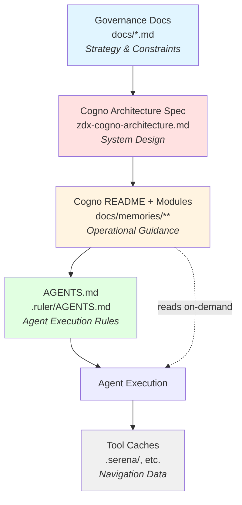

# Memory System Documentation

## TL;DR
- ZDX Cogno (short: **Cogno**) is the operational memory system that lives in `docs/memories/`. It translates the canonical governance artefacts in `docs/` into actionable guidance. Architecture/Product own the governance layer; Engineering owns Cogno.
- Cogno is layered: each memory area ships with a concise `*.core.md` summary, optional deep-dive modules, and a `manifest.yaml` listing those modules.
- `docs/memories/zdx-cogno-architecture.md` is the canonical specification for Cogno; this README is the quick reference.
- `.ruler/AGENTS.md` mirrors this information for agents. Whenever you change Cogno, keep the cascade aligned (governance doc → architecture spec → this README → agent rules).

## Quick Links

### Tier 1: Governance (Strategic)
- `docs/index.md` – Canonical documentation index (start here to find the right upstream artefact)
- `docs/PRD.md` – WHAT and WHY (product requirements anchor)
- `docs/constitution.md` – Non-negotiable principles
- `docs/roadmap.md` – Implementation roadmap and stages

### Tier 2: Architecture (Tactical)
- `docs/architecture.md` – HOW system is built (decision summary, patterns, structure)
- `docs/architecture-decisions.md` – WHY decisions were made (detailed ADRs)
- `docs/tech-stack.md` – WHICH versions to use (pinning strategy)

### Tier 3: Operational (This System)
- `docs/memories/zdx-cogno-architecture.md` – Canonical architecture spec for Cogno
- `docs/memories/memory-index.json` – Generated lookup table for manifest metadata (do not edit manually)
- `docs/memories/topics.md` – Topical index mapping common task keywords to memory areas
- `.ruler/AGENTS.md` – Source of agent rules that reference Cogno (→ `CLAUDE.md`)

## Feature Implementation Intake Checklist

Follow this lightweight intake before starting substantial implementation or memory updates:

1. `docs/index.md` → open the relevant canonical artefact(s) and note the governing section(s).
2. Cogno steering → skim this README, check `docs/memories/topics.md` for relevant areas, then open the pertinent `*.core.md` summary.
3. Planning hygiene → run Sequential Thinking MCP to outline your approach.
4. Assumption check → run Vibe-Check MCP to surface risks or hidden dependencies.
5. Traceability → capture the canonical reference and alignment rationale (you’ll need it when updating manifests or proposing changes).

## Upstream Governance (Canonical Layer)

- **Tier 1** (Governance): `PRD.md` (WHAT/WHY anchor), `constitution.md` (principles), `roadmap.md` (roadmap). Product/Architecture leadership owns these.
- **Tier 2** (Architecture): `architecture.md` (HOW - decision summary, patterns, structure), `architecture-decisions.md` (WHY - detailed ADRs), `tech-stack.md` (WHICH versions). Architecture team owns these.
- **Tier 3** (Operational): This memory system (Cogno). Engineering owns these. Cogno derives guidance from Tier 1 and 2 artefacts.

**Cascade rule**: Changes flow DOWN the tiers. Lower tiers MUST align with higher tiers. When governance docs change, update Cogno modules accordingly.

- Use `docs/index.md` to locate the appropriate governance document, then read it fully before editing Cogno. Cite it in the module's references or checklist.
- When proposing a new memory, explicitly explain how it supports the referenced canonical document (include doc name + rationale).

---

## Overview

This directory contains the monorepo's **institutional knowledge** – the patterns, decisions, and discoveries that define how this codebase works. It serves as long-term memory for AI agents and documentation for developers.

**Purpose**: Prevent pattern drift, avoid rework, and ensure consistency as the monorepo evolves.

---

## Cogno Steering Snapshot

- **Cascade**: Governance docs (`docs/`) → `zdx-cogno-architecture.md` → `README.md` → `.ruler/AGENTS.md`.
- **Structure**: Each memory area provides a `*.core.md` summary, optional modules, and a manifest. Modules stay small and topical.
- **Manifests**: Track `id`, `title`, `file`, `tags`, optional `checksum`, `validation_status`, `last_updated_by`, `last_updated_at`. No remote sync fields.
- **Future integrations**: Any external tooling must ingest from Cogno; nothing else is authoritative.

### Cascade Flow Diagram



**What this shows:**
- **Solid arrows**: Cascade propagation (updates flow top-down)
- **Dotted line**: On-demand reading (agents read Cogno during execution)
- **Colors**: Each layer has distinct purpose and audience

---

## The Problem We're Solving

### Scenario: Pattern Drift

**Month 1**: Generate `apps/web` with Nx → adopt co-located tests in `src/`
**Month 6**: Generate `apps/mobile` with Nx → framework defaults to `__tests__/` directory
**Result**: Two different test patterns in the same monorepo ❌

### Scenario: Forgotten Constraints

**Month 1**: Discover Prisma packages need `--bundler=none`, document in tech log
**Month 6**: New developer generates database package with `--bundler=tsc`
**Result**: Hours wasted debugging broken imports ❌

### Scenario: Architectural Regression

**Month 1**: Decide on `moduleResolution: bundler` for base config, `nodenext` for test configs
**Month 6**: Agent sees generated `node10`, thinks "this is the new standard"
**Result**: Workspace configuration breaks, tests fail ❌

### The Solution: Memory System

This directory captures **transferable knowledge** that applies across multiple components, ensuring consistency and preventing rework. Cogno’s manifests and index make this knowledge fast to discover without leaving the repo.

---

## Memory Files

### `adopted-patterns.md`

**Purpose**: "This is how WE do it in THIS monorepo" – overrides framework defaults.

**Content**:
- Test file locations (co-located in `src/`)
- TypeScript configuration standards (`moduleResolution: bundler` for base, `nodenext` for tests)
- Jest configuration patterns (workspace preset inheritance)
- Code organization conventions
- Dependency version standards

**When to read**:
- Before generating new apps or packages
- Before changing build/test/TypeScript configurations
- Before making architectural suggestions
- When onboarding new team members

**When to update**:
- When establishing a new convention that applies across components
- When framework defaults conflict with our monorepo standards
- When solving a problem that will recur in similar components

---

### `post-generation-checklist.md`

**Purpose**: Mandatory steps after running Nx generators.

**Content**:
- After `nx g @nx/jest:configuration`: Update TypeScript module resolution
- After `nx g @nx/js:lib`: Verify test location matches adopted pattern
- After `nx g @nx/node:app`: Check TypeScript version consistency
- After generating Prisma packages: Install dependencies, create directory structure

**When to read**:
- Immediately before running any `nx g` command (to prepare)
- Immediately after running any `nx g` command (to execute fixes)

**When to update**:
- When discovering a generator creates code that needs fixing
- When the fix is required for consistency with adopted patterns
- When the fix will apply to future uses of the same generator

---

### `tech-findings-log.md`

**Purpose**: Technical decisions, empirical findings, known constraints.

**Content**:
- Why Prisma packages use `--bundler=none` (architectural constraint)
- Why we use `import type` for server router types (technical pattern)
- Jest hanging on Windows (empirical troubleshooting)
- Nx cache corruption patterns (operational findings)

**When to read**:
- Before suggesting architecture changes
- When troubleshooting build/test/runtime errors
- When making technology stack decisions
- When evaluating alternatives to current approaches

**When to update**:
- When making a technical decision with non-obvious rationale
- When discovering empirical findings from troubleshooting
- When identifying constraints or limitations of tools/frameworks
- When investigating alternatives and rejecting them for specific reasons

**Difference from adopted-patterns.md**:
- Tech findings = **why** (rationale, constraints)
- Adopted patterns = **what** (standards, conventions)

---

### Reference Documentation (`testing-reference`, `troubleshooting`, …)

These directories follow the layered pattern: a `*.core.md` summary plus focused modules stored in dedicated directories. Use the manifest to locate the modules you need—no remote sync required. Maintenance checklists inside each area describe the authoring expectations.

---

### Spec‑Kit Research Artifacts

Purpose: Clarify the two Phase 0 research artifacts for agents.

- `research.md` (canonical narrative)
  - Contains decisions, rationales, alternatives, and resolved clarifications.
  - Always produced/updated during Phase 0; consumed by downstream Spec‑Kit steps.

- `research-validation.md` (external validation evidence)
  - Produced when Phase 0 identifies material changes (new libs, cross‑project changes, API/data model, security/infra, DB/ORM).
  - Consolidates MCP server findings (Context7, Exa, web) to validate chosen patterns.

Guidance for agents:
- Always update `research.md` in Phase 0.
- Produce `research-validation.md` only when material changes exist.
- CI validates presence of `research-validation.md` when material changes are detected and accepts `research.md` alone otherwise.

---

## Agent Workflow Integration

### Session Start
```
1. Read current-task.md (if exists) – where did we leave off?
2. Read relevant sections of adopted-patterns.md – what are our standards?
```

### Before Generating Components
```
1. Read adopted-patterns.md – what patterns must I follow?
2. Read post-generation-checklist.md – what will I need to fix?
3. Run: pnpm exec nx g <command>
```

### After Generating Components
```
1. Execute post-generation-checklist.md – apply mandatory fixes
2. Validate against adopted-patterns.md – does it match our standards?
3. Test: build, lint, test targets work correctly
```

### When Implementing Features
```
1. Read integration-recipes.md – how do components connect?
2. Read tech-findings-log.md – any constraints I should know about?
3. Implement following established patterns
```

### When Troubleshooting
```
1. Read troubleshooting.md – common solutions for development issues
2. Read testing-reference.md – if issue is test-related (configuration, coverage, Jest setup)
3. Read known-issues.md – is this a known problem with a workaround?
4. Read tech-findings-log.md – any empirical findings related to this?
5. Search for similar symptoms
```

### Before Suggesting Changes
```
1. Read architecture-decisions.md – why did we choose our current approach?
2. Read adopted-patterns.md – does this conflict with established patterns?
3. Read tech-findings-log.md – were alternatives already rejected?
```

### During Long Tasks
```
1. Update current-task.md – checkpoint progress every 30-60 minutes
2. Update adopted-patterns.md – if discovering new cross-component patterns
3. Update tech-findings-log.md – if discovering new constraints
```

---

## Memory System Principles

These principles continue to govern what belongs in memory. See `zdx-cogno-architecture.md` for lifecycle mechanics, manifests, and sync triggers.

### 1. Cross-Component Knowledge
Memory captures **transferable patterns** that apply to **multiple similar contexts**.

✅ **DO capture**:
- "When you generate ANY package with Jest, update moduleResolution to nodenext"
- "How to integrate REST API client in React-based apps (web, mobile)"
- "TypeScript configuration standards for ALL projects"

❌ **DON'T capture**:
- Single-use fixes ("Fixed bug in web/page.tsx line 42")
- Component-specific details ("Web app uses port 3000")
- Already well-documented patterns (standard Next.js routing)

### 2. Non-Obvious Knowledge
Memory captures what ISN'T obvious from official documentation.

✅ **DO capture**:
- Integration patterns combining multiple technologies
- Empirical findings from troubleshooting
- Monorepo-specific configuration requirements

❌ **DON'T capture**:
- Standard framework documentation (link to official docs instead)
- Self-explanatory code patterns
- Generic programming concepts

### 3. Recurring Patterns
Memory captures knowledge you'll need **again when adding similar components**.

✅ **DO capture**:
- Post-generation fixes that apply to every similar generator
- Integration patterns used by multiple apps
- Configuration patterns repeated across packages

❌ **DON'T capture**:
- One-time migrations or refactorings
- Historical context that won't affect future work
- Deprecated patterns no longer in use

### 4. Preventive Knowledge
Memory captures **solutions to prevent future problems**.

✅ **DO capture**:
- "Don't use --bundler=tsc for Prisma packages" (prevents broken imports)
- "Always check test location after generation" (prevents pattern drift)
- "Verify TypeScript version matches workspace" (prevents version conflicts)

❌ **DON'T capture**:
- Problems that only occurred once
- Issues resolved by updating dependencies
- Bugs fixed in code (not configuration/patterns)

---

## Operational Artifacts

- **Memory System Architecture** – authoritative reference for Cogno’s state model and workflow.
- **Memory Index (`docs/memories/memory-index.json`)** – generated map from manifest data to support tooling. Never hand edit this file.

---

## How to Maintain the Memory System

### Regular Maintenance

**Monthly review** (recommended):
1. Review `known-issues.md` – remove resolved issues.
2. Review `current-task.md` – clear if stale.
3. Review `adopted-patterns.md` – update "Last Validated" dates.
4. Check for patterns that should be moved between files.

**When updating frameworks**:
1. Test post-generation-checklist.md with new generator versions.
2. Update "Last Validated" dates in adopted-patterns.md.
3. Document any new generator issues discovered.

**When adding new apps/packages**:
1. Follow existing patterns from memory files.
2. Document any NEW patterns discovered.
3. Update checklists if generators behave differently.

### Cascade Maintenance

**When governance docs change** (`docs/architecture-decisions.md`, `docs/tech-stack.md`, etc.):
1. Identify which Cogno modules are affected
2. Update `zdx-cogno-architecture.md` first (if system design changes)
3. Update affected `*.core.md` files and modules
4. Update `README.md` (if quick-reference changes)
5. Update `.ruler/AGENTS.md` with minimal execution rules (≤50 lines per cycle)
6. Update `cascade-version` frontmatter fields to match

**Cascade health checks**:
- Frontmatter `cascade-version` dates synchronized across files
- Links between documents remain valid
- No duplication (each concept documented once at appropriate layer)
- AGENTS.md remains concise (loaded every chat session)

**Tools**: Use `.claude/commands/zdx/memory-checkpoint.md` to validate alignment after updates.

### Quality Standards

**Good memory entry**:
- Clear, concise, actionable.
- Includes rationale (why, not just what).
- Has validation steps.
- Links to related docs.
- Dated with "Last Validated".
- Complete frontmatter (title, purpose, audience, dates).

**Bad memory entry**:
- Vague or ambiguous.
- No explanation of why.
- No way to verify if applied correctly.
- Orphaned (no context for when to use it).
- Missing or incomplete frontmatter.

---

## FAQ

### Why not just use code comments?
Code comments explain **individual files**. Memory files explain **cross-component patterns** and **monorepo-wide decisions**.

### Why not use external documentation tools?
External tools require context switching. Memory files live in the repo, are version-controlled, and are immediately accessible to AI agents.

### How is this different from CLAUDE.md?
- `CLAUDE.md` = general agent behavior and project overview.
- `docs/memories/` = specific patterns, decisions, and discoveries.

### What if a pattern changes?
Update the relevant memory file, document the change, update "Last Validated" date, and notify the team. Memory evolves with the project.

### How does Cogno relate to code navigation tools like Serena?

**Different layers, complementary purposes.**

- **Cogno**: Governance layer (patterns, decisions, standards) - "WHAT and WHY"
- **Serena/etc**: Navigation layer (symbols, structure, locations) - "WHERE and HOW"

Think of Cogno as the architectural blueprint and building codes, while tools like Serena are the site maps and GPS. You need both.

**When working with both:**
1. Consult Cogno for standards and patterns (before implementing)
2. Use navigation tools to explore and implement efficiently
3. Validate implementation against Cogno (before committing)

Cogno remains tool-agnostic by focusing on governance, not navigation.

### How do I know which file to update?
Use the decision tree:
- Monorepo-wide standard → `adopted-patterns.md`
- Post-generator fix → `post-generation-checklist.md`
- Technical constraint → `tech-findings-log.md`
- Temporary workaround → `known-issues.md`
- Integration pattern → `integration-recipes.md`
- Strategic decision → `architecture-decisions.md`

---

## Memory System Status

**Phase 1 (Current)** – Core Foundation:
- ✅ `adopted-patterns.md` – 10 patterns documented
- ✅ `post-generation-checklist.md` – 5 checklists documented
- ✅ `tech-findings-log.md` – Migrated and enhanced
- ✅ `testing-reference.md` – Comprehensive Jest and testing configuration reference
- ✅ `troubleshooting.md` – Common development troubleshooting solutions
- ✅ `README.md` – This file (now consolidated; see architecture spec for chunking rules)

**Phase 1 Complete (Canonical Docs)**:
- ✅ `docs/architecture-decisions.md` – Stage 4.1 (REST+OpenAPI), Stage 4.2 (Supabase+Prisma+RLS)
- ✅ `docs/tech-stack.md` – Complete version inventory with pinning strategy
- ✅ `docs/roadmap.md` – Walking skeleton implementation plan

**Phase 2 (Planned)** – Expansion:
- ⏳ `known-issues.md` – Active bugs and workarounds
- ⏳ `integration-recipes.md` – Cross-component integration patterns
- ⏳ `current-task.md` – Active work state

**Phase 3 (Future)** – Advanced:
- Automated validation scripts
- Memory quality metrics
- Memory search/indexing tools
- Integration with CI/CD

---

## Contributing

When you discover new patterns, constraints, or solutions:

1. **Determine which file** the knowledge belongs in.
2. **Use the template** provided in that file (or copy an existing section).
3. **Test the pattern** with a fresh generation/implementation.
4. **Link related docs** for cross-reference.
5. **Update dates** in frontmatter.

**Quality checklist**:
- [ ] Clear and actionable
- [ ] Includes rationale (why, not just what)
- [ ] Has validation/verification steps
- [ ] Dated with "Last Validated"
- [ ] Links to related documentation
- [ ] Tested with actual code

---

**Last Updated**: 2025-12-02
**Status**: Phase 1 Complete – Cogno file-based system operational, BMAD-aligned tier structure
**Maintainer**: Development Team

