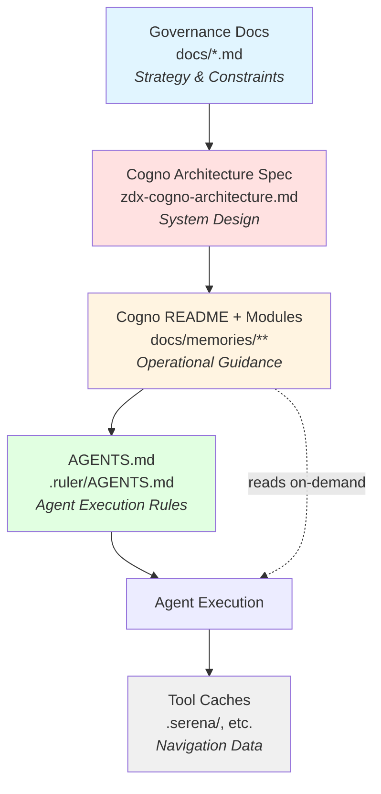

## Cogno Architecture Specification

### Purpose
- Define how ZDX Cogno (the file-based memory system) is structured and maintained.
- Clarify the split between top-down governance artefacts (`docs/*.md`) and bottom-up operational knowledge (`docs/memories/**`).
- Establish the authoritative cascade: governance docs → this spec → `docs/memories/README.md` → `./.ruler/AGENTS.md`.
- Provide deterministic read/write guidance so every agent interacts with Cogno consistently.

### Upstream Governance (Canonical Layer)
- Start with `docs/index.md` to locate the relevant governance artefact (e.g. `roadmap.md`, `architecture-decisions.md`, `tech-stack.md`, `constitution.md`). These documents are owned by architecture/product leadership.
- Cogno derives actionable implementation guidance from those sources. Development leads own Cogno content but MUST align it with the upstream documents.
- When governance artefacts change, Cogno stewards are responsible for updating this spec, the README, and relevant modules to keep the layers synchronized.

### Cogno State Model
1. **Core steering docs**: this architecture spec and `docs/memories/README.md`.
2. **Knowledge packages**: each memory area (e.g., adopted-patterns, troubleshooting) exposes:
   - One `*.core.md` summary for fast intake.
   - Optional module files (`module-*.md`) for depth on a single topic.
   - A `manifest.yaml` enumerating every module.
3. **Workspace index**: `docs/memories/memory-index.json` mirrors manifest metadata to help tooling discover chunks. Generated only—never hand edited.
4. **Operational tooling**: `.claude/commands/zdx/memory-checkpoint.md` prompts agents to validate canonical alignment, identify gaps, and record rationale before proposing new memories; `docs/memories/topics.md` accelerates discovery by mapping task keywords to memory areas and synonyms.

### Module Authoring Guidance
- Keep `*.core.md` files scannable; they summarise scope and link to deeper modules rather than containing exhaustive detail.
- Create or update a `module-XX-topic.md` file when guidance exceeds roughly 50 lines, includes detailed workflows/code, or represents a distinct scenario that others will reuse.
- Add brief (<50 line) updates or global principles directly to the core summary when immediate visibility matters and depth is minimal.
- Split patterns/modules when an entry grows beyond ~100 lines or covers multiple independent scenarios (e.g. break Pattern 5 into 5.1/5.2). Each split should receive its own manifest entry and cross-references.

There is no remote mirror. Cogno lives entirely in the repository. Any future adapter must treat these files as the single source of truth.

### Manifest Schema (per memory area)
Each `manifest.yaml` entry MUST contain:
- `id`: stable chunk identifier (`prefix-topic`).
- `title`: human-readable name.
- `file`: path to the module file (relative to the manifest).
- `tags`: list of taxonomy tags (used for search/filtering).
- `checksum`: optional SHA-256 of the file content (set by tooling; leave `null` when editing manually).
- `validation_status`: one of `valid`, `needs_review`, `draft` (defaults to `needs_review` when editing).
- `last_updated_by`: agent or human author.
- `last_updated_at`: ISO 8601 timestamp (UTC).

Fields that assumed remote syncing (`sync_status`, `byterover_id`, `last_synced_at`) are removed. Tooling may extend manifests with additional local fields, but they MUST NOT reintroduce external identifiers.

### Read Workflow
1. Confirm context in governance docs  
   - Review the relevant canonical artefact(s) in `docs/` (brief, PRD, architecture, ADRs, tech stack) to understand intent and constraints.
2. Start with Cogno steering docs  
   - Architects updating the memory system read this spec.  
   - Day-to-day agents begin with `docs/memories/README.md` for the high-level map and consult `docs/memories/topics.md` to pinpoint relevant areas.
2. Determine which memory area is relevant.
3. Read the `*.core.md` summary for that area.
4. Consult the manifest to locate specific modules. Open only the modules required for the task.  
5. Record the files you consulted in your work notes (encouraged for traceability).

### Write Workflow
1. Use `docs/index.md` to identify the governing artefact(s) in `docs/` that justify the new or updated memory. Capture the exact section/title for traceability.
2. Update or create module file(s). Keep scope focused—one topic per file.
3. Update the manifest entry:
   - Add new `id`, `title`, `file`, `tags` if creating a module.
   - Reset `checksum: null` and set `validation_status: needs_review` when content changes.
   - Update `last_updated_by` / `last_updated_at`.
4. Update the `*.core.md` summary if the quick reference needs to reflect the change.
5. Run any manual validation steps described in the relevant “How to update” / maintenance checklist (e.g., rerun generators, copy command snippets).
6. When proposing the change (e.g., to a human reviewer), explicitly state which canonical document the memory aligns with and why it supports that guidance.
7. Regenerate the workspace index if automation isn’t available (future tooling will automate this).

### Layered Documentation Layout
```
docs/memories/
  README.md                     # Steering overview (no manifest)
  zdx-cogno-architecture.md     # This document
  adopted-patterns/
    adopted-patterns.core.md
    manifest.yaml
    module-01-*.md
    module-02-*.md
  testing-reference/
    testing-reference.core.md
    manifest.yaml
    module-*.md
  ...
```
- Core files provide TL;DR, quick links, and change history.
- Modules store the actionable depth.
- Manifests act as the table of contents for tooling and agents.

### Future Integration Hooks (Optional)
If we introduce a secondary storage layer later:
- Treat Cogno as the system of record. External systems ingest from these files.
- Create a separate adapter document describing additional fields or workflows.
- Do not reintroduce remote-oriented fields into manifests or steering docs without architectural sign-off.

### Cascade & Communication

**Cascade Model:**

Cogno operates within a multi-layer documentation cascade. Each layer serves a distinct purpose and audience:



**Layer Responsibilities:**

1. **Governance docs** (`docs/*.md`): Strategic decisions, architectural constraints, product requirements (owned by architecture/product leadership)
2. **Cogno Architecture Spec** (this document): System design, state model, canonical workflows (owned by Cogno stewards)
3. **Cogno README + Modules**: Day-to-day operational guidance, patterns, checklists (owned by development leads)
4. **AGENTS.md**: Concise execution rules for AI agents (derived from layers above)
5. **Tool Caches**: Operational data for navigation tools like Serena (derived from Cogno, not authoritative)

**Cascade Propagation Process:**

When governance changes, updates must flow through the cascade:

1. **Identify impact**: Which Cogno modules are affected by the governance change?
2. **Update architecture spec** (if structural changes needed): Update this document first
3. **Update README** (if quick-reference changes needed): Reflect changes in steering doc
4. **Update memory modules**: Update affected `*.core.md` files and modules
5. **Update AGENTS.md**: Add minimal execution rules (≤50 lines per update cycle)
6. **Track propagation**: Update `propagated-to` fields in frontmatter

**Cascade Maintenance Triggers:**

Cascade updates are required when:
- Governance documents change (`docs/architecture-decisions.md`, `docs/tech-stack.md`, etc.)
- New patterns discovered during implementation that contradict current guidance
- Memory modules reach consensus on standardization (adopted-patterns.md updates)
- Architectural constraints identified through troubleshooting (tech-findings-log.md updates)
- Tools like `.claude/commands/zdx/memory-checkpoint.md` flag drift between code and documented patterns

**Cascade Validation:**

Use these checks to ensure cascade health:
- Frontmatter tracking: Check `cascade-version` dates are synchronized
- Reference integrity: Links between documents remain valid
- Terminology consistency: "ZDX Cogno" (or "Cogno") used uniformly
- AGENTS.md conciseness: File growth monitored (loaded every chat session)
- No duplication: Each concept documented once at appropriate layer

### Relationship to Tool-Specific Operational Caches

Cogno is a **governance and knowledge management system**, not a code indexing or navigation tool.

Some AI development tools (e.g., Serena MCP) maintain their own operational caches for symbol-level indexing, code navigation, and structural exploration.

**Coexistence principles:**

1. **Separate namespaces**: Tool caches live outside `docs/memories/` (e.g., `.serena/`)
2. **Different purposes**: Cogno = governance/standards, Tool caches = navigation/exploration
3. **Cogno as input**: Tools read and internalize Cogno during setup
4. **One-way sync**: Tools read Cogno, but never write to Cogno programmatically
5. **Priority**: Cogno governance overrides tool cache information

**Example: Serena MCP**
- Reads `docs/memories/` during onboarding to understand patterns
- Creates `.serena/memories/` for operational code navigation
- Uses Cogno as source of truth for standards
- Uses its own cache for efficient symbol exploration

This separation keeps Cogno tool-agnostic while allowing specialized tools to augment AI capabilities.
